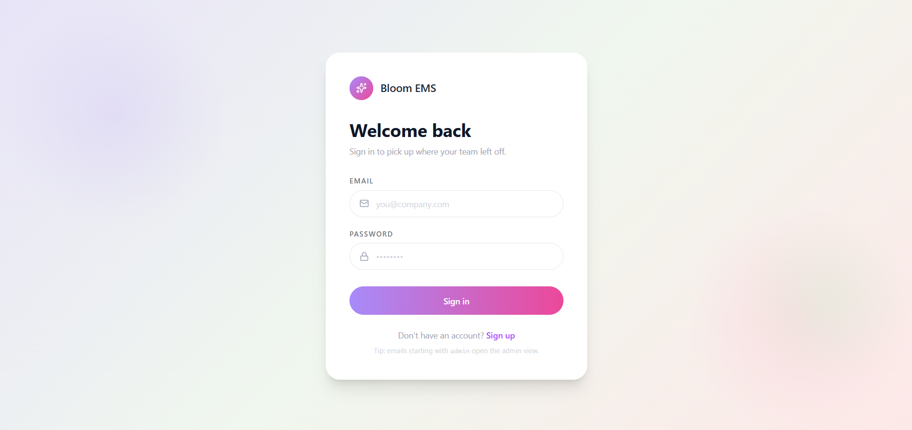

# 🌸 Bloom EMS

A modern Employee Management System built with **React**, **Context API**, **Tailwind CSS**, and **Vite**. Bloom simplifies employee task management with a clean interface, real-time state updates, and complete task lifecycle management.

## 🚀 Live Demo

**Application:** https://bloom-ems.vercel.app/

**GitHub Repository:**
https://github.com/yashtyagi9306/Employee-Management-System

---

# ✨ Features

## Authentication

* Admin Login
* Employee Login
* Persistent session using Local Storage

## Admin Dashboard

* Create Tasks
* Edit Existing Tasks
* Delete Tasks
* Assign Tasks to Employees
* Employee Search
* Team Statistics
* Modern Dashboard UI

## Employee Dashboard

* Accept Tasks
* Mark Tasks as Completed
* Mark Tasks as Failed
* Reopen Completed/Failed Tasks
* Filter Tasks

  * All
  * New
  * Active
  * Completed
  * Failed

## User Experience

* Modern SaaS-inspired UI
* Toast Notifications
* Smooth Animations
* Empty States
* Professional Form Validation
* Persistent State using Local Storage

---

# 🖼 Screenshots

## Login

> Add `login.png`

## Admin Dashboard

## Login



## Employee Dashboard


# 🛠 Tech Stack

| Category         | Technology    |
| ---------------- | ------------- |
| Frontend         | React         |
| Build Tool       | Vite          |
| Styling          | Tailwind CSS  |
| State Management | Context API   |
| Data Storage     | Local Storage |
| Icons            | Lucide React  |

---

# 🏗 Architecture

```
Local Storage
        │
        ▼
AuthProvider (Context API)
        │
        ▼
Global User State
        │
 ┌──────┴────────┐
 │               │
 ▼               ▼
Admin        Employee
Dashboard    Dashboard
```

The application follows a centralized state management approach where **AuthProvider** acts as the single source of truth. Every CRUD operation updates Context first, synchronizes Local Storage, and automatically re-renders the UI.

---

# 📁 Project Structure

```
src
│
├── assets
├── components
│   ├── Auth
│   ├── Dashboard
│   ├── TaskList
│   └── other
│
├── context
├── utils
├── App.jsx
└── main.jsx
```

---

# ⚙ Installation

```bash
git clone https://github.com/yashtyagi9306/Employee-Management-System.git

cd Employee-Management-System

npm install

npm run dev
```

---

# 🎯 Key Highlights

* Complete CRUD Operations
* Centralized State Management
* Dynamic Task Lifecycle
* Modern Dashboard Design
* Persistent User Sessions
* Clean Component-Based Architecture
* Live Deployment on Vercel

---

# 🚀 Future Improvements

* Responsive Mobile Layout
* Analytics Dashboard
* Push Notifications
* Backend Integration
* Cloud Database Support
* Role-Based Permissions

---

# 👨‍💻 Author

**Yash Tyagi**

LinkedIn: *https://www.linkedin.com/in/yashtyagi21/*

GitHub: https://github.com/yashtyagi9306

---

## ⭐ If you found this project interesting, consider giving it a star.
